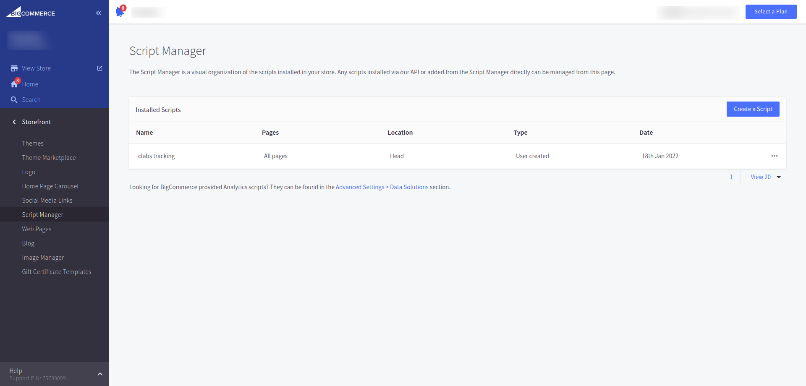
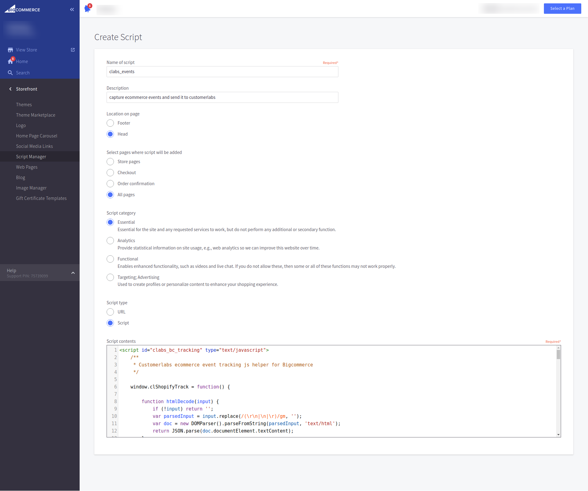

GoTo Online Store  -> Storefront -> Script Manager -> click "Create a Script"

Under "Create Script" section 
1. Add Name to your script
2. Select **Home** option in *Location on page* section
3. Select **All pages** option in *Select pages where script will be added* section
4. Select **Essential** option in *Script category* section
5. Select **Script** option in *Script type* section
6. Copy code snippit from **cl_default_ecommerce_events.html** page and Past it under *Script contents* section

## Script Manager

## Create Script

